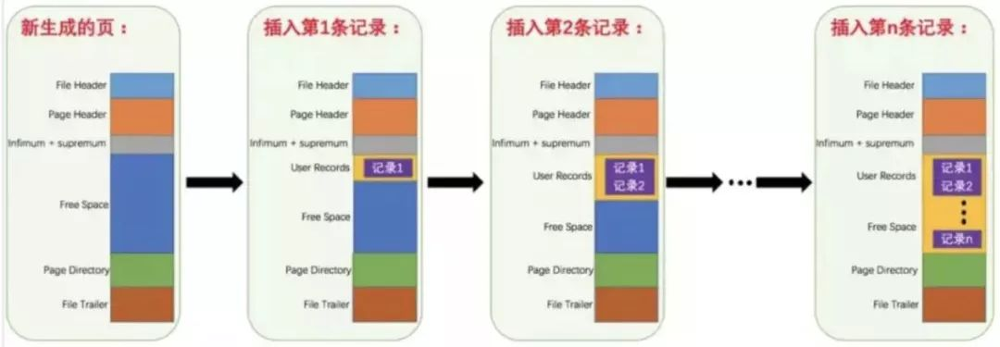

《爱上面试官》系列-数据库索引
=================

前言

写数据库，我第一时间就想到了MySQL、Oracle、索引、存储过程、查询优化等等。

不知道大家是不是跟我想得一样，我最想写的是索引，为啥呢？

以下这个面试场景，不知道大家熟悉不熟悉：

面试官：数据库有几千万的数据，查询又很慢我们怎么办？

面试者：加索引。

面试官：那索引有哪些数据类型？索引是怎么样的一种结构？哪些字段又适合索引呢？B+的优点？聚合索引和非聚合索引的区别？为什么说索引会降低插入、删除、修改等维护任务的速度？……..

面试者：面试官怎么出我们公司门来着。

是的大家可能都知道慢了加索引，那为啥加，在什么字段上加，以及索引的数据结构特点，优点啥的都比较模糊或者甚至不知道。

那我们也不多BB了，直接开始这次的面试吧。

正文
--

> 我看你简历上写到了熟悉MySQL数据库以及索引的相关知识，我们就从索引开始，索引有哪些数据结构？

Hash、B+

大家去设计索引的时候，会发现索引类型是可以选择的。

> 为什么哈希表、完全平衡二叉树、B树、B+树都可以优化查询，为何Mysql独独喜欢B+树？

我先聊一下Hash：

大家可以先看一下下面的动图

注意字段值所对应的数组下标是哈希算法随机算出来的，所以可能出现哈希冲突。

那么对于这样一个索引结构，现在来执行下面的sql语句：

select \* from sanguo where name='鸡蛋'

可以直接对‘鸡蛋’按哈希算法算出来一个数组下标，然后可以直接从数据中取出数据并拿到所对应那一行数据的地址，进而查询那一行数据， 那么如果现在执行下面的sql语句：

select \* from sanguo where name\>'鸡蛋'

则无能为力，因为哈希表的特点就是可以快速的精确查询，但是不支持范围查询。

如果做成了索引，那速度也是很慢的，要全部扫描。

> 问个题外话，那Hash表在哪些场景比较适合？

等值查询的场景，就只有KV（Key，Value）的情况，例如Redis、Memcached等这些NoSQL的中间件。

> 你说的是无序的Hash表，那有没有有序的数据结构？

有序数组，它就比较优秀了呀，它在等值查询的和范围查询的时候都很Nice。

> 那它完全没有缺点么？

不是的，有序的适合静态数据，因为如果我们新增、删除、修改数据的时候就会改变他的结构。

比如你新增一个，那在你新增的位置后面所有的节点都会后移，成本很高。

> 那照你这么说他根本就不优秀啊，特点也没地方放。

此言差矣，可以用来做静态存储引擎啊，用来保存静态数据，例如你2019年的支付宝账单，2019年的淘宝购物记录等等都是很合适的，都是不会变动的历史数据。

> 有点东西啊小伙子，那二叉树呢？

二叉树的新增和结构如图：

二叉树的结构我就不在这里多BB了，不了解的朋友可以去看看数据结构章节。

二叉树是有序的，所以是支持范围查询的。

但是他的时间复杂度是O(log(N))，为了维持这个时间复杂度，更新的时间复杂度也得是O(log(N))，那就得保持这棵树是完全平衡二叉树了。

> 怎么听你一说，平衡二叉树用来做索引还不错呢？

此言差矣，索引也不只是在内存里面存储的，还是要落盘持久化的，可以看到图中才这么一点数据，如果数据多了，树高会很高，查询的成本就会随着树高的增加而增加。

为了节约成本很多公司的磁盘还是采用的机械硬盘，这样一次千万级别的查询差不多就要10秒了，这谁顶得住啊？

> 如果用B树呢？

同理来看看B树的结构：

可以发现同样的元素，B树的表示要比完全平衡二叉树要“矮”，原因在于B树中的一个节点可以存储多个元素。

B树其实就已经是一个不错的数据结构，用来做索引效果还是不错的。

> 那为啥没用B树，而用了B+树？

一样先看一下B加的结构：

我们可以发现同样的元素，B+树的表示要比B树要“胖”，原因在于B+树中的非叶子节点会冗余一份在叶子节点中，并且叶子节点之间用指针相连。

> 那么B+树到底有什么优势呢？

其实很简单，我们看一下上面的数据结构，最开始的Hash不支持范围查询，二叉树树高很高，只有B树跟B+有的一比。

B树一个节点可以存储多个元素，相对于完全平衡二叉树整体的树高降低了，磁盘IO效率提高了。

而B+树是B树的升级版，只是把非叶子节点冗余一下，这么做的好处是为了提高范围查找的效率。

提高了的原因也无非是会有指针指向下一个节点的叶子节点。

小结：到这里可以总结出来，Mysql选用B+树这种数据结构作为索引，可以提高查询索引时的磁盘IO效率，并且可以提高范围查询的效率，并且B+树里的元素也是有序的。

> 那么，一个B+树的节点中到底存多少个元素最合适你有了解过么？

额这个这个？卧\*有点懵逼呀。

过了一会还是没想出，只能老实交代：这个不是很了解咳咳。

> 你可以换个角度来思考B+树中一个节点到底多大合适？

B+树中一个节点为一页或页的倍数最为合适。

> 为啥？

因为如果一个节点的大小小于1页，那么读取这个节点的时候其实也会读出1页，造成资源的浪费。

如果一个节点的大小大于1页，比如1.2页，那么读取这个节点的时候会读出2页，也会造成资源的浪费。

所以为了不造成浪费，所以最后把一个节点的大小控制在1页、2页、3页、4页等倍数页大小最为合适。

> 你提到了页的概念，能跟我简单说一下么？

首先Mysql的基本存储结构是页(记录都存在页里边)：

* 各个数据页可以组成一个双向链表
* 而每个数据页中的记录又可以组成一个单向链表
* - 每个数据页都会为存储在它里边儿的记录生成一个页目录，在通过主键查找某条记录的时候可以在页目录中使用二分法快速定位到对应的槽，然后再遍历该槽对应分组中的记录即可快速找到指定的记录
* 以其他列(非主键)作为搜索条件：只能从最小记录开始依次遍历单链表中的每条记录。

所以说，如果我们写 select \* from user where username='丙丙'这样没有进行任何优化的sql语句，默认会这样做：

* 定位到记录所在的页
* - 需要遍历双向链表，找到所在的页
* 从所在的页内中查找相应的记录
* - 由于不是根据主键查询，只能遍历所在页的单链表了

很明显，在数据量很大的情况下这样查找会很慢！看起来跟回表有点点像。

> 哦？回表你聊一下。

卧槽，该死，我嘴干嘛。

回表大概就是我们有个主键为ID的索引，和一个普通name字段的索引，我们在普通字段上搜索：

sql select \* from table where name = '丙丙'

执行的流程是先查询到name索引上的“丙丙”，然后找到他的id是2，最后去主键索引，找到id为2对应的值。

回到主键索引树搜索的过程，就是回表。不过也有方法避免回表，那就是覆盖索引。

> 哦？那你再跟我聊一下覆盖索引呗？

！！！我这个嘴。。。

这个其实比较好理解，刚才我们是 select \* ，查询所有的，我们如果只查询ID那，其实在Name字段的索引上就已经有了，那就不需要回表了。

覆盖索引可以减少树的搜索次数，提升性能，他也是我们在实际开发过程中经常用来优化查询效率的手段。

很多联合索引的建立，就是为了支持覆盖索引，特定的业务能极大的提升效率。

> 索引的最左匹配原则知道么？

最左匹配原则：

* 索引可以简单如一个列 (a)，也可以复杂如多个列 (a,b,c,d)，即联合索引。
* 如果是联合索引，那么key也由多个列组成，同时，索引只能用于查找key是否存在（相等），遇到范围查询 (\>、\<、between、like左匹配)等就不能进一步匹配了，后续退化为线性查找。
* 因此，列的排列顺序决定了可命中索引的列数。

例子：

* 如有索引 (a,b,c,d)，查询条件 a=1 and b=2 and c\>3 and d=4，则会在每个节点依次命中a、b、c，无法命中d。(c已经是范围查询了，d肯定是排不了序了)

总结
--

索引在数据库中是一个非常重要的知识点！

上面谈的其实就是索引最基本的东西，N叉树，跳表、LSM我都没讲，同时要创建出好的索引要顾及到很多的方面：

* 最左前缀匹配原则。这是非常重要、非常重要、非常重要（重要的事情说三遍）的原则，MySQL会一直向右匹配直到遇到范围查询 （\>,\<,BETWEEN,LIKE）就停止匹配。
* 尽量选择区分度高的列作为索引，区分度的公式是 COUNT(DISTINCT col)/COUNT(\*)。表示字段不重复的比率，比率越大我们扫描的记录数就越少。
* 索引列不能参与计算，尽量保持列“干净”。比如， FROM\_UNIXTIME(create\_time)='2016-06-06' 就不能使用索引，原因很简单，B+树中存储的都是数据表中的字段值，但是进行检索时，需要把所有元素都应用函数才能比较，显然这样的代价太大。所以语句要写成 ：create\_time=UNIX\_TIMESTAMP('2016-06-06')。
* 尽可能的扩展索引，不要新建立索引。比如表中已经有了a的索引，现在要加（a,b）的索引，那么只需要修改原来的索引即可。
* 单个多列组合索引和多个单列索引的检索查询效果不同，因为在执行SQL时，MySQL只能使用一个索引，会从多个单列索引中选择一个限制最为严格的索引(经指正，在MySQL5.0以后的版本中，有“合并索引”的策略，翻看了《高性能MySQL 第三版》，书作者认为：还是应该建立起比较好的索引，而不应该依赖于“合并索引”这么一个策略)。
* “合并索引”策略简单来讲，就是使用多个单列索引，然后将这些结果用“union或者and”来合并起来

思路文献参考：

《MySQL实战》

《高性能MySQL》

最后部分内容来自-\>java3y《索引和锁》

丁奇《MySQL实战》

-
