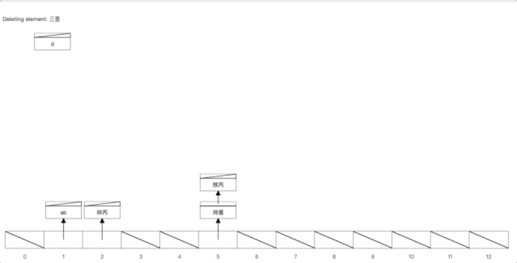
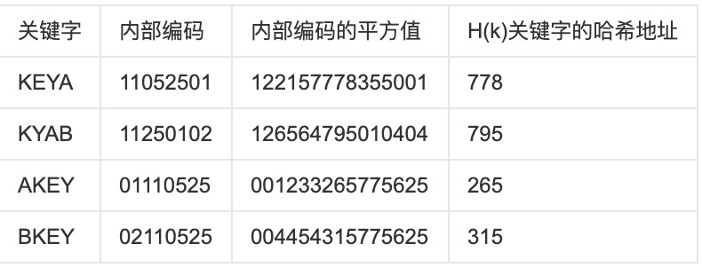
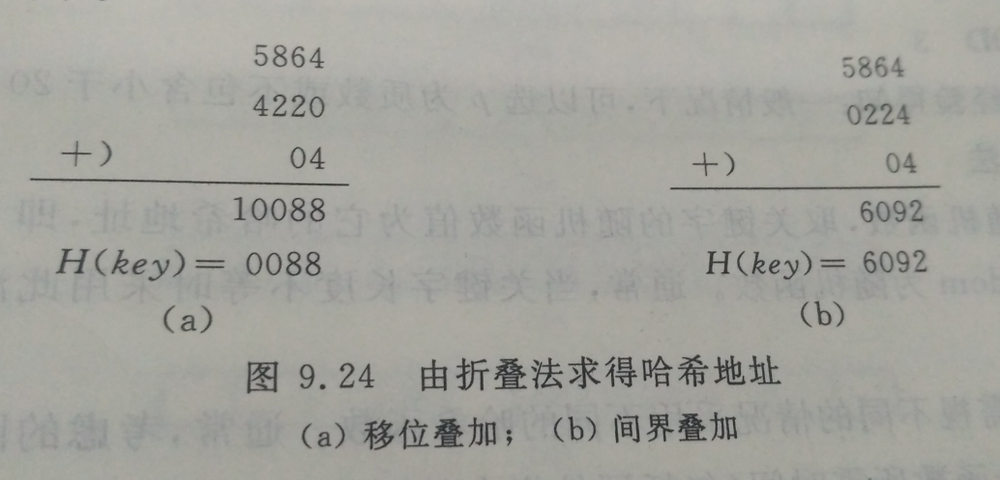

# 哈希表与哈希（Hash）算法

## 一、概述
假设有关键字为`k`,则其值存放在`f(k)`的`存储位置`上.这样,不需比较便可直接取得所查记录.f(k)为`Hash函数`,按这个思想建立的表为`Hash表`.

但是在f(k)的计算过程中,会出现不同的k计算出相同的值,这也称为`Hash冲突`,为了解决这个问题,我们还需要一个处理冲突的方法.

综上所述,根据`Hash函数f(k)`和`处理冲突的方法`将一组`关键字`映射到一个`有限的连续的地址集(区间)`上,并以关键字在地址集中的"像"作为记录在表中的存储位置,这种表便称为`Hash表`,这一映射过程称为Hash造表或Hash,所得的存储位置称`Hash地址`.

文字看不懂?看如下图就Hash计算过程


## 二、常用方法
1. `直接寻址法`: 取关键字或关键字的某个线性函数值为哈希地址.
 > 即:`H(key)=key或H(key) = a·key + b`.其中a和b为常数（这种Hash函数叫做自身函数）.若其中H(key）中已经有值了,就往下一个找,直到H(key）中没有值了,就放进去.
 例如: 有一个1岁到100岁的人口数字统计表,其中,年龄作为关键字,哈希函数取关键字自身.如下表所示:

|  地址 |01|02|03|...|20|21|...|200|
|---|---|---|---|---|---|---|---|---|
|   年龄|1|2|3|...|20|21|...|200|
|   人数|200|199|198|...|180|179|...|1|

> 这样若要询问25岁的人有多少,则只要查表的第25项即可.
由于直接定址所得的地址集合和关键字集合的大小相同.因此,对于不同的关键字不会发生冲突,但是实际中能使用这种哈希函数的情况很少.

2. `数字分析法`: 假设`关键字是以r为基数的数`（如: 以10为基的十进制数）,`并且哈希表中可能出现的关键字都是事先知道的`,则可取`关键字的若干数位组成哈希地址`.

 > 比如一组员工的出生年月日,这时我们发现出生年月日的前几位数字大体相同,这样的话,出现冲突的几率就会很大,但是我们发现年月日的后几位表示月份和具体日期的数字差别很大,如果用后面的数字来构成哈希地址,则冲突的几率会明显降低.因此数字分析法就是找出数字的规律,尽可能利用这些数据来构造冲突几率较低的哈希地址.

3. `平方取中法`: 当无法确定关键字中哪几位分布较均匀时,可以先`求出关键字的平方值`,然后按需要取`平方值的中间几位作为哈希地址`.这是因为:平方后中间几位和关键字中每一位都相关,故不同关键字会以较高的概率产生不同的哈希地址.
> 我们把英文字母在字母表中的位置序号作为该英文字母的内部编码.例如K的内部编码为11,E的内部编码为05,Y的内部编码为25,A的内部编码为01, B的内部编码为02.由此组成关键字"KEYA"的内部代码为11052501,同理我们可以得到关键字"KYAB"、"AKEY"、"BKEY"的内部编码.之后对关键字进行平方运算后,取出第7到第9位作为该关键字哈希地址,
>  如下图所示:

> 

4. `折叠法`: 将关键字分割成位数相同的几部分,最后一部分位数可以不同,然后取这几部分的叠加和（去除进位）作为哈希地址.数位叠加可以有移位叠加和间界叠加两种方法.移位叠加是将分割后的每一部分的最低位对齐,然后相加；间界叠加是从一端向另一端沿分割界来回折叠,然后对齐相加.

> 例如: 每一中西文图书都有一个国际标准图书编号（ISBN）,它是一个10位的十进制数字,若要以它作关键字建立一个哈希表,当馆藏书种类不到 10000 时,可采用折叠法构造一个四位数的哈希函数.在折叠法中数位叠加可以有移位叠加和间界叠加两种方法.移位叠加是将分割后的每一部分的最低位对齐,然后相加；间界叠加是从一端向另一端沿分割界来回折叠,然后对齐相加.如国际标准图书编号0-442-20586-4的哈希地址分别如图 （a）和（b）所示.

> 

5. `随机数法`: 选择一`随机函数`,取关键字的`随机值`作为`哈希地址`,即`H(key)=random(key)`其中random为随机函数,通常用于关键字长度不等的场合.

6. `除留余数法`: 取关键字被某个不大于哈希表表长m的数p除后所得的余数为哈希地址.即 `H(key) = key MOD p,p<=m`.不仅可以对关键字直接取模,也可在折叠、平方取中等运算之后取模.对p的选择很重要,一般取素数或m,若p选的不好,容易产生同义词.

## 三、处理冲突
1. `开放寻址法`: Hi=(H(key) + di) MOD m,i=1,2,…,k(k<=m-1）,其中H(key）为哈希函数,m为哈希表长,di为增量序列,可有下列三种取法:
```
+ di=1,2,3,…,m-1,称线性探测再哈希.
+ di=1^2,-1^2,2^2,-2^2,⑶^2,…,±（k)^2,(k<=m/2）称二次探测再哈希.
+ di=伪随机数序列,称伪随机探测再哈希.
```

2. `再哈希法`: Hi=RHi(key),i=1,2,…,k RHi均是不同的哈希函数,即在同义词产生地址冲突时计算另一个哈希函数地址,直到冲突不再发生,这种方法不易产生“聚集”,但增加了计算时间.

3. `链地址法`（拉链法） HashMap的使用方法
将所有关键字为同义词的记录存储在同一线性链表中.假设某哈希函数产生的哈希地址在区间[0,m -1 ]上,则设立一个指针型向量
Chain ChainHash[m]
其每个分量的初始状态都是空指针.凡哈希地址为i的记录都插入到头指针为ChainHash[i]的链表中.在链表中的插入位置可以在表头或表尾；也可以在中间,以保持同义词在同一线性链表中按关键字有序.

4. `建立一个公共溢出区`
这也是处理冲突的一种方法、假设哈希函数的值域为[ 0, m - 1 ],则设向量HashTable[ 0..m - 1 ]为基本表,每个分量存放一个记录,另设向量OverTable[0..v]为溢出表.所有关键字和基本表中关键字为同义词的记录,不管它们由哈希函数得到的哈希地址是什么,一旦发生冲突,都填入溢出表.


